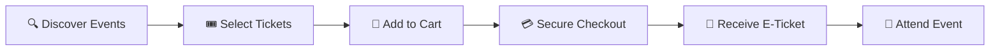
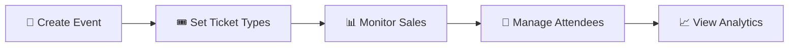
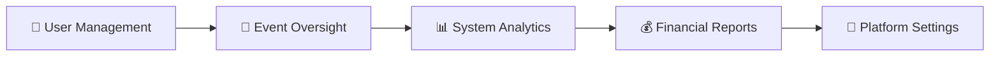

# 🎫 TickFest - Your Ultimate Event Ticketing Platform

<div align="center">


[](https://reactjs.org/)
[](https://vitejs.dev/)
[](https://tailwindcss.com/)
[](https://firebase.google.com/)

**🌟 Discover • 🎟️ Book • 🎉 Experience Amazing Events**

[🚀 Live Demo](https://tickfest.com) • [📖 Documentation](https://docs.tickfest.com) • [🐛 Report Bug](https://github.com/Ashik70021/TickFest/issues)

</div>

## 📋 Table of Contents

- [🌟 Features](#-features)
- [🏗️ Tech Stack](#️-tech-stack)
- [🚀 Quick Start](#-quick-start)
- [💡 Core Functionalities](#-core-functionalities)
- [👥 User Roles](#-user-roles)
- [🎨 UI/UX Highlights](#-uiux-highlights)
- [📱 Responsive Design](#-responsive-design)
- [🔧 Project Structure](#-project-structure)
- [🌐 API Integration](#-api-integration)
- [🔒 Security Features](#-security-features)
- [🤝 Contributing](#-contributing)
- [📄 License](#-license)

## 🌟 Features

### 🎫 **Event Discovery & Booking**
- 🔍 **Advanced Search** - Find events by category, location, date, and keywords
- 🏷️ **Smart Filtering** - Filter by price range, event type, and popularity
- 📅 **Calendar Integration** - View events in calendar format
- 🎯 **Personalized Recommendations** - AI-powered event suggestions

### 👤 **User Management**
- 🔐 **Secure Authentication** - Email/password, Google, and Facebook login
- 👨‍💼 **Multi-Role System** - Users, Organizers, and Admins
- 📊 **User Dashboard** - Personal event history and preferences
- 🎖️ **Profile Management** - Complete user profile customization

### 🎪 **Event Organization**
- ➕ **Easy Event Creation** - Intuitive event setup wizard
- 🖼️ **Rich Media Support** - Image uploads and gallery management
- 🎟️ **Ticket Management** - Multiple ticket types and pricing
- 📈 **Analytics Dashboard** - Real-time event performance metrics

### 💳 **Payment & Checkout**
- 🛒 **Smart Cart System** - Add multiple tickets with quantity control
- 💰 **Secure Payments** - Multiple payment gateway integration
- 📧 **E-Ticket Generation** - Instant digital ticket delivery
- 🔄 **Refund Management** - Automated refund processing

## 🏗️ Tech Stack

<div align="center">

| Frontend | Backend | Database | Authentication | Styling |
|----------|---------|----------|----------------|---------|
|  |  |  |  |  |
|  |  |  |  |  |
|  |  |  |  |  |

</div>

### 🛠️ **Technology Breakdown**

#### **Frontend Stack**
- **⚛️ React 18.2+**: Modern component-based UI library
- **🏗️ Vite**: Lightning-fast build tool and dev server
- **🌐 HTML5**: Semantic markup structure
- **🎨 Tailwind CSS**: Utility-first CSS framework
- **🌼 DaisyUI**: Beautiful component library for Tailwind
- **✨ Custom CSS**: Additional styling and animations
- **📦 React Libraries**: React Router, React Hooks, Context API

#### **Backend Stack**
- **🐘 PHP**: Server-side scripting language
- **🌐 REST API**: RESTful web services architecture
- **🖥️ Apache**: Web server (XAMPP/WAMP/LAMP)
- **📡 HTTP/HTTPS**: Secure communication protocols

#### **Database & Storage**
- **🗄️ MySQL**: Relational database management system
- **⚙️ phpMyAdmin**: Database administration interface
- **🔗 PDO/MySQLi**: PHP database connection layers

#### **Authentication & Security**
- **🔥 Firebase Authentication**: User authentication service
- **🔐 JWT Tokens**: Secure API authentication
- **🛡️ PHP Security**: Input validation and sanitization

## 🚀 Quick Start

### Prerequisites
- 📦 Node.js (v18 or higher)
- 🔥 Firebase Account
- � PHP (v8.0 or higher)
- 🗄️ MySQL Database
- 🖥️ Apache Server (XAMPP/WAMP/LAMP)

### Installation

1. **Clone the repository**
   ```bash
   git clone https://github.com/Ashik70021/TickFest.git
   cd TickFest
   ```

2. **Install frontend dependencies**
   ```bash
   npm install
   ```

3. **Setup Backend (PHP)**
   ```bash
   # Copy project to your web server directory
   # For XAMPP: copy to htdocs/tickfest
   # For WAMP: copy to www/tickfest
   # For LAMP: copy to /var/www/html/tickfest
   ```

4. **Database Setup**
   ```sql
   -- Create database
   CREATE DATABASE tickfest_db;
   
   -- Import database structure
   -- Use phpMyAdmin or command line to import database.sql
   ```

5. **Environment Setup**
   ```bash
   # Frontend .env file
   VITE_FIREBASE_API_KEY=your_firebase_api_key
   VITE_FIREBASE_AUTH_DOMAIN=your_auth_domain
   VITE_FIREBASE_PROJECT_ID=your_project_id
   VITE_API_URL=http://localhost/tickfest/api
   ```

   ```php
   // Backend config.php
   <?php
   define('DB_HOST', 'localhost');
   define('DB_USER', 'your_db_user');
   define('DB_PASS', 'your_db_password');
   define('DB_NAME', 'tickfest_db');
   ?>
   ```

6. **Start the development server**
   ```bash
   # Start frontend
   npm run dev
   
   # Start backend (make sure Apache/MySQL are running)
   # Access via: http://localhost/tickfest
   ```

7. **Build for production**
   ```bash
   npm run build
   ```

## 💡 Core Functionalities

### 🎯 **For Event Attendees**


- **Event Discovery**: Browse 1M+ events across 50+ cities
- **Smart Search**: AI-powered search with filters and recommendations
- **Social Integration**: Share events and invite friends
- **Wishlist**: Save favorite events for later
- **Review System**: Rate and review attended events

### 🎪 **For Event Organizers**


- **Event Management**: Complete event lifecycle management
- **Ticket Configuration**: Multiple ticket types, early bird pricing
- **Attendee Management**: Check-in system and attendee communication
- **Financial Dashboard**: Revenue tracking and payout management
- **Marketing Tools**: Promotional codes and social media integration

### 👨‍💼 **For Administrators**


- **User Management**: Comprehensive user and organizer oversight
- **Event Moderation**: Approve and monitor event listings
- **Analytics Dashboard**: Platform-wide performance metrics
- **Financial Management**: Transaction monitoring and commission tracking
- **System Configuration**: Platform settings and feature toggles

## 👥 User Roles

<div align="center">

| 🎭 Role | 🔑 Permissions | 🎯 Primary Actions |
|---------|---------------|-------------------|
| **👤 User** | View events, Book tickets, Manage profile | 🔍 Browse, 🎟️ Purchase, ⭐ Review |
| **🎪 Organizer** | Create events, Manage tickets, View analytics | ➕ Create, 📊 Monitor, 👥 Manage |
| **👨‍💼 Admin** | Full system access, User management, Platform oversight | 🛠️ Configure, 📈 Analyze, 🔒 Moderate |

</div>

## 🎨 UI/UX Highlights

### 🌈 **Design Philosophy**
- **Modern Gradient Theme**: Purple to blue gradient design language
- **Glassmorphism Effects**: Frosted glass UI elements with backdrop blur
- **Micro-interactions**: Smooth animations and hover effects
- **Accessibility First**: WCAG 2.1 compliant with keyboard navigation

### 🎪 **Key Components**
- **🏠 Hero Banner**: Dynamic search with animated background
- **🎯 Event Cards**: Interactive cards with hover animations
- **📱 Mobile Carousel**: Touch-friendly horizontal scrolling
- **🎨 Background Animations**: Floating particles and geometric shapes
- **🔍 Smart Search**: Real-time search with autocomplete
- **🌼 DaisyUI Components**: Beautiful pre-built UI components
- **✨ Custom Animations**: CSS keyframes and Tailwind animations

## 📱 Responsive Design

<div align="center">

| 📱 Mobile | 📱 Tablet | 💻 Desktop | 🖥️ Large Screen |
|-----------|-----------|------------|------------------|
| 320px - 639px | 640px - 1023px | 1024px - 1535px | 1536px+ |
| **🔄 Carousel View** | **🏗️ Grid Layout** | **🖼️ Full Layout** | **🌟 Enhanced View** |
| Touch optimized | Hybrid navigation | Complete features | Premium experience |

</div>

### 📱 **Mobile Optimizations**
- **🎠 Card Carousel**: Horizontal scrolling for event cards
- **🔍 Simplified Search**: Streamlined mobile search experience
- **👆 Touch Gestures**: Swipe and touch-friendly interactions
- **⚡ Performance**: Optimized loading and smooth animations

## 🔧 Project Structure

```
TickFest/
├── 📁 public/
│   ├── 🖼️ events/           # Event images and assets
│   └── 🎨 vite.svg          # App icons
├── 📁 src/
│   ├── 🧩 components/       # Reusable UI components
│   │   ├── 🎪 Banner.jsx    # Hero section with search
│   │   ├── 🎟️ cards/       # Event card components
│   │   ├── 🛒 Checkout/     # Payment and checkout
│   │   ├── 📱 common/       # Shared components
│   │   ├── 🏠 Pages/        # Main page components
│   │   └── 📊 Dashboard/    # Admin & user dashboards
│   ├── 🔥 firebase-config/  # Firebase configuration
│   ├── 🎨 layouts/          # Page layout components
│   ├── 🔐 Providers/        # Context providers
│   ├── 🛣️ routes/           # App routing configuration
│   └── 🛠️ utils/            # Utility functions
├── � backend/              # PHP Backend
│   ├── 🔌 api/              # REST API endpoints
│   │   ├── 🎪 events.php    # Events API
│   │   ├── 👤 auth/         # Authentication APIs
│   │   ├── 🎟️ bookings.php  # Booking management
│   │   └── 📊 analytics.php # Analytics endpoints
│   ├── 🗄️ config/           # Database configuration
│   ├── 🛡️ middleware/       # Authentication middleware
│   └── 🛠️ utils/            # PHP utility functions
├── 📁 database/
│   ├── 🗄️ schema.sql        # Database structure
│   ├── 🌱 seeders.sql       # Sample data
│   └── 📋 migrations/       # Database migrations
├── 📄 package.json          # Frontend dependencies
├── ⚙️ vite.config.js        # Vite configuration
├── 🎨 tailwind.config.js    # Tailwind + DaisyUI config
└── 📖 README.md             # Project documentation
```

## 🌐 API Integration

### 🔌 **PHP REST API Endpoints**
```php
// 🎪 Events API
GET    /api/events.php              // 📜 Get all events
GET    /api/events.php?featured=1   // ⭐ Get featured events
POST   /api/events.php              // ➕ Create new event
PUT    /api/events.php?id={id}      // ✏️ Update event
DELETE /api/events.php?id={id}      // 🗑️ Delete event

// 👤 User Management
POST   /api/auth/login.php          // 🔐 User login
POST   /api/auth/register.php       // 📝 User registration
GET    /api/users/profile.php       // 👤 Get user profile
PUT    /api/users/profile.php       // ✏️ Update profile

// 🎟️ Booking System
POST   /api/bookings.php            // 🛒 Create booking
GET    /api/bookings.php?user={id}  // 📋 Get user bookings
PUT    /api/bookings.php?id={id}    // ✏️ Update booking status

// 📊 Analytics
GET    /api/analytics.php           // 📈 Get analytics data
GET    /api/reports.php             // 📋 Generate reports
```

### 🗄️ **Database Schema**
```sql
-- Users Table
CREATE TABLE users (
    id INT PRIMARY KEY AUTO_INCREMENT,
    uid VARCHAR(255) UNIQUE,
    name VARCHAR(255),
    email VARCHAR(255) UNIQUE,
    role ENUM('user', 'organizer', 'admin'),
    created_at TIMESTAMP DEFAULT CURRENT_TIMESTAMP
);

-- Events Table
CREATE TABLE events (
    id INT PRIMARY KEY AUTO_INCREMENT,
    name VARCHAR(255),
    description TEXT,
    category VARCHAR(100),
    location VARCHAR(255),
    date_time DATETIME,
    organizer_id INT,
    status ENUM('active', 'inactive', 'completed'),
    created_at TIMESTAMP DEFAULT CURRENT_TIMESTAMP
);

-- Bookings Table
CREATE TABLE bookings (
    id INT PRIMARY KEY AUTO_INCREMENT,
    user_id INT,
    event_id INT,
    ticket_quantity INT,
    total_amount DECIMAL(10,2),
    booking_status ENUM('pending', 'confirmed', 'cancelled'),
    created_at TIMESTAMP DEFAULT CURRENT_TIMESTAMP
);
```

## 🔒 Security Features

- **� Firebase Authentication**: Secure user authentication with Google/Facebook login
- **🛡️ PHP Security**: Input validation, sanitization, and SQL injection prevention
- **🚫 XSS Prevention**: Output escaping and CSRF token protection
- **🔒 HTTPS Enforcement**: Secure data transmission
- **👨‍💼 Role-based Access**: Granular permission system with PHP sessions
- **💳 Payment Security**: Secure payment processing with encryption
- **🗄️ Database Security**: Prepared statements and connection security

## 🚀 Performance Features

- **⚡ Vite Build Tool**: Lightning-fast development and builds
- **🎨 Tailwind + DaisyUI**: Optimized CSS with component reusability
- **🖼️ Image Optimization**: Lazy loading and responsive images
- **📦 Code Splitting**: Route-based code splitting with React
- **🗄️ Efficient Caching**: Browser caching and PHP OPcache
- **🐘 PHP Optimization**: Optimized database queries and connection pooling
- **📱 Mobile Performance**: Touch-optimized interactions and carousel

## 🧪 Testing & Quality

- **🔍 ESLint**: Code quality and consistency
- **🎨 Prettier**: Code formatting
- **📱 Responsive Testing**: Cross-device compatibility
- **🔄 Git Hooks**: Pre-commit quality checks

## 🤝 Contributing

We love contributions! 🎉 Here's how you can help:

1. **🍴 Fork the repository**
2. **🌿 Create your feature branch** (`git checkout -b feature/AmazingFeature`)
3. **💾 Commit your changes** (`git commit -m 'Add some AmazingFeature'`)
4. **📤 Push to the branch** (`git push origin feature/AmazingFeature`)
5. **🔄 Open a Pull Request**

### 📋 **Contribution Guidelines**
- Follow the existing code style
- Write clear commit messages
- Test your changes thoroughly
- Update documentation as needed

## 🙏 Acknowledgments

- **🎨 Design Inspiration**: Modern event platforms and design systems
- **📚 React Ecosystem**: React community and component libraries
- **🔥 Firebase**: Authentication and real-time services
- **🎨 Tailwind CSS**: Utility-first CSS framework
- **🌼 DaisyUI**: Beautiful component library
- **🐘 PHP Community**: Server-side scripting and best practices
- **🗄️ MySQL**: Reliable database management system

## 👨‍💻 Author

**Ashik Ahmed**
- 🐱 GitHub: [@Ashik70021](https://github.com/Ashik70021)
- 💼 LinkedIn: [Ashik Ahmed](https://linkedin.com/in/ashik-ahmed)
- 📧 Email: ashik.ahmed@example.com

## 📄 License

This project is licensed under the MIT License - see the [LICENSE](LICENSE) file for details.

---

<div align="center">

**🎫 Made with ❤️ for the event community**

[](https://github.com/Ashik70021/TickFest)
[](https://github.com/Ashik70021/TickFest/fork)
[](https://github.com/Ashik70021/TickFest)

**[🔝 Back to top](#-tickfest---your-ultimate-event-ticketing-platform)**

</div>
